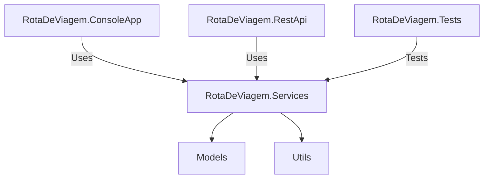

# Rota de Viagem

## Overview
<!--
Rota de Viagem is a .NET application designed to find the cheapest travel route between two locations, regardless of the number of connections. 
-->
Rota de Viagem is a [.NET](https://dotnet.microsoft.com/pt-br/download) application designed to find the cheapest travel route between two locations, regardless of the number of connections. The application uses Dijkstra's algorithm to process the routes. It consists of a console interface and a REST API, allowing users to query routes and register new ones.

## Technologies Used
- [C# / .NET Core 8.0](https://dotnet.microsoft.com/pt-br/download)
- [xUnit for unit testing](https://xunit.net/)
- [REST API using ASP.NET Core](https://dotnet.microsoft.com/pt-br/apps/aspnet)

## Project Structure
```
RotaDeViagem
├── RotaDeViagem.ConsoleApp
│   ├── Program.cs
│   ├── RotaDeViagem.ConsoleApp.csproj
├── RotaDeViagem.Services
│   ├── RouteService.cs
│   ├── Models
│   │   └── Route.cs
│   ├── Utils
│   │   └── CsvHelper.cs
│   ├── RotaDeViagem.Services.csproj
├── RotaDeViagem.RestApi
│   ├── Controllers
│   │   └── RoutesController.cs
│   ├── Program.cs
│   ├── Startup.cs
│   ├── RotaDeViagem.RestApi.csproj
├── RotaDeViagem.Tests
│   ├── RouteServiceTests.cs
│   ├── RotaDeViagem.Tests.csproj
├── rotas.csv
├── RotaDeViagem.sln
└── README.md
```

## Setup Instructions
1. **Download or clone the source code zip.**
*  **Clone the repository**: Clone the repository using the following command:
  ```sh
  git clone https://github.com/viniciusr-cmd/rota-de-viagem.git
  ```

2. **Open the solution**: Open the solution file `RotaDeViagem.sln` in your preferred C# / .NET development environment, such as [Visual Studio](https://visualstudio.microsoft.com/pt-br/) or [JetBrains Rider](https://www.jetbrains.com/pt-br/rider/).
3. **Restore NuGet packages**: Restore the NuGet packages for each project by running the following command in the solution directory:
  ```sh
  dotnet restore
  ```
4. **Build the solution**: Build the solution to ensure all projects compile successfully. You can do this from your development environment or by running:
  ```sh
  dotnet build
  ```

## Usage
### Console Application
1. Navigate to the `RotaDeViagem.ConsoleApp` project.
2. Run the application using the following command:
  ```sh
  dotnet run --project RotaDeViagem.ConsoleApp/RotaDeViagem.ConsoleApp.csproj rotas.csv
  ```
3. The application will display the menu (in Portuguese):
```sh
Digite a rota (DE-PARA). 'list' para listar destinos disponíveis. 'sair / exit' para encerrar:
```

Query a new route by entering the origin, destination. Type `list` to display all available destinations or `sair` to exit.

4. The application will display the best route and its cost.
Example:
  - **Input**: BRC-CDG.
  - **Output**: Melhor Rota: 'BRC -> SCL -> ORL -> CDG' ao custo de $30.

### REST API
1. Navigate to the `RotaDeViagem.RestApi` project.
2. Run the application using the following command:
  ```sh
  dotnet run --project RotaDeViagem.RestApi/RotaDeViagem.RestApi.csproj
  ```
### Endpoints

| Method | Endpoint | Description |
|--------|----------|-------------|
| POST | [/api/routes/add-route](https://localhost:5000/api/routes/add-route) | Register a new route. The request body should contain `Origin`, `Destination` and `Cost`. |
| GET | [/api/routes/best?origin={origin}&destination={destination}](https://localhost:5000/api/routes/best-route?origin={origin}&destination={destination}) | Query the best route between two locations. |

#### POST `/api/routes/add-route`
**Request Body Example (JSON):**
```json
{
  "origin": "RIO",
  "destination": "GRU",
  "cost": 5
}
```

**Response Body Example (JSON):**
```json
{
  "message": "Rota criada com sucesso.",
  "route": {
    "origin": "RIO",
    "destination": "GRU",
    "cost": 5
  }
}
```

**cURL Example:**
```sh
curl --request POST \
  --url https://localhost:5000/api/routes/add-route \
  --header 'content-type: application/json' \
  --data '{
  "origin": "RIO",
  "destination": "GRU",
  "cost": 5
}'
```

#### GET `/api/routes/best?origin={origin}&destination={destination}`

**Response Body Example (JSON):**
- Input: GRU-CDG
```json
{
  "message": "Rota encontrada com sucesso",
  "origin": "GRU",
  "destination": "CDG",
  "bestRoute": "GRU -> BRC -> SCL -> ORL -> CDG",
  "cost": 40
}
```

**cURL Example:**
```sh
curl -X GET "https://localhost:5000/api/routes/best-route?origin=GRU&destination=CDG"
```

#### GET `/api/routes/list-routes`
**Response Body Example (JSON):**
```json
{
  "message": "Rotas disponíveis",
  "routes": "GRU - BRC - SCL - CDG - ORL - RIO"
}
```

**cURL Example:**
```sh
curl --request GET \
  --url https://localhost:5000/api/routes/list-routes
```

## Testing
### Running Tests
To run the unit tests, navigate to the `RotaDeViagem.Tests` project and execute the following command:
```sh
dotnet test
```
If all tests pass, you will see output similar to the following:
```
[xUnit.net 00:00:00.00] xUnit.net VSTest Adapter v2.4.5+1caef2f33e (64-bit .NET 8.0.11)
[xUnit.net 00:00:00.22]   Discovering: RotaDeViagem.Tests
[xUnit.net 00:00:00.24]   Discovered:  RotaDeViagem.Tests
[xUnit.net 00:00:00.24]   Starting:    RotaDeViagem.Tests
[xUnit.net 00:00:00.28]   Finished:    RotaDeViagem.Tests
RotaDeViagem.Tests test succeeded (0.8s)

Test summary: total: 3, failed: 0, succeeded: 3, skipped: 0, duration: 0.8s
```

Note that the tests are written using the xUnit framework and are located in the `RotaDeViagem.Tests` project.
If you add a new route or modify the business logic, you should update the tests to ensure that the changes do not break existing functionality.

## Design Decisions and Architecture

### Overview
Rota de Viagem application is designed to separate concerns and ensure scalability, maintainability, and testability. The application is divided into several projects, each with a specific responsibility.

### Architecture Diagram


### Project Responsibilities
- **RotaDeViagem.ConsoleApp**: Contains the console interface for interacting with the application. It allows users to query routes and display the best route and its cost.
- **RotaDeViagem.Services**: Contains the core business logic of the application. It includes services for managing routes, models representing the data, and utility classes for tasks such as reading CSV files.
- **RotaDeViagem.RestApi**: Provides a RESTful API for querying and registering routes. It allows external applications to interact with the core functionality of the application.
- **RotaDeViagem.Tests**: Contains unit tests to ensure the correctness of the business logic in the `RotaDeViagem.Services` project.

### Design Decisions
1. **Separation of Concerns**: By dividing the application into multiple projects, each with a specific responsibility, we ensure that the code is modular and easier to maintain.
2. **Scalability**: The architecture allows for easy addition of new features. For example, new types of interfaces (e.g., a web frontend) can be added without modifying the core business logic.
3. **Testability**: By isolating the business logic in the `RotaDeViagem.Services` project, we can write unit tests to verify its correctness without dependencies on the console or REST API interfaces.
4. **Reusability**: The `RotaDeViagem.Services` project can be reused by different types of clients (e.g., console app, REST API) without duplicating code.